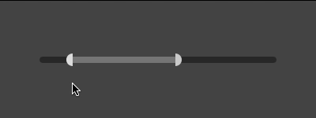
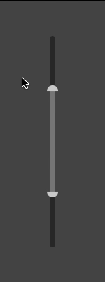
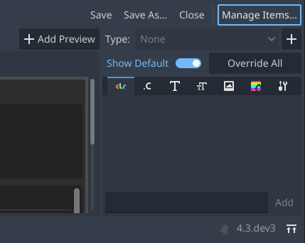
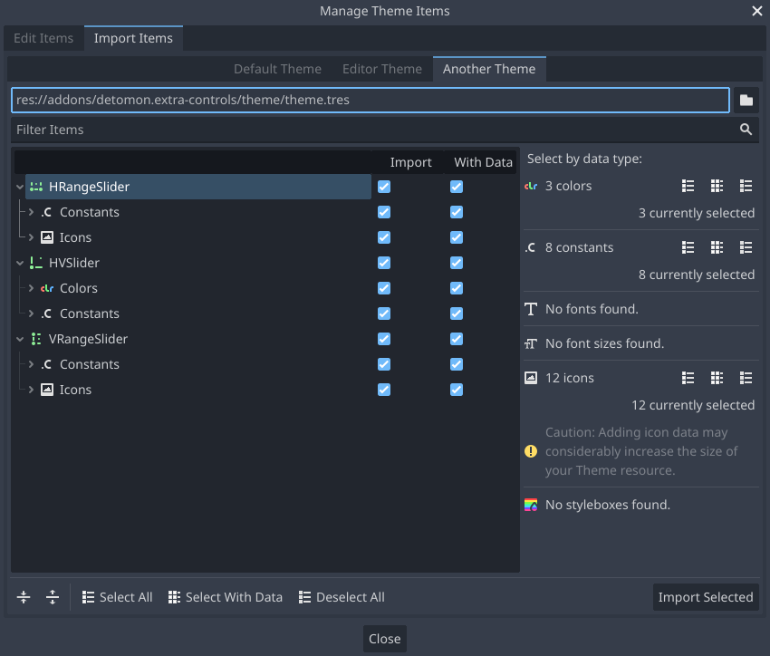

# Assorted Controls for Godot Engine

An incomplete collection of various control nodes.

- [Installation](#installation)
- [Usage](#usage)
- [Control nodes](#control-nodes)
	- [HVSlider](#hvslider)
	- [HRangeSlider](#hrangeslider)
	- [VRangeSlider](#vrangeslider)
- [Using custom themes](#using-custom-themes)

## Installation

1. Search for `Assorted Controls` in the `AssetLib` editor tab.
2. Download and install the plugin.
3. Enable the plugin in the project settings via the `Plugins` tab.

or...

1. Clone this repository or download the archive.
2. Copy the folder `addons/detomon.assorted-controls` to your project's `addons` folder (create it if needed).
3. Enable the plugin in the project settings via the `Plugins` tab.

## Usage

1. Add the desired control nodes to a scene.
2. Apply the theme located in `res://addons/detomon.assorted-controls/theme/theme.tres` to the control or a parent control.
3. Alternatively, import the default theme's properties into a [custom theme](#using-custom-themes).

*When the theme is missing, some control elements are not drawn.*

## Control nodes

### [HVSlider](docs/hv_slider.md)

A 2D slider that goes from bottom left (`min_value`) to top right (`max_value`), used to set independant values for the horizontal and vertical axis.

### [HRangeSlider](docs/h_range_slider.md)

A slider that goes from left (`min_value`) to right (`max_value`), used to adjust a range by moving grabbers along a horizontal axis.

### [VRangeSlider](docs/v_range_slider.md)

A slider that goes from bottom (`min_value`) to top (`max_value`), used to adjust a range by moving grabbers along a vertical axis.

## Using custom themes

When using a custom theme, you can import the properties for the used control nodes from the default theme.

1. Edit your custom theme resource.
2. In the bottom `Theme` panel, click on `Manage Items...`.

3. Select the `Import Items` tab.
4. Select the `Another Theme` tab.
5. Choose the default theme file (`res://addons/detomon.assorted-controls/theme/theme.tres`) by clicking on the folder icon.
6. Select below which nodes and properties should be imported into your custom theme.
7. Click `Import Selected`

