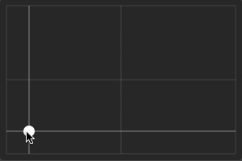

# HVSlider

A 2D slider that goes from bottom left (`min_value`) to top right (`max_value`) allowing to set independant values for the horizontal and vertical axis.

When allowing the control to be focused (setting `focus_mode` to `Control.FOCUS_CLICK` or `Control.FOCUS_ALL`), the value can be changed with the editor's default directional input actions (`ui_left`, `ui_right`, `ui_up`, and `ui_down`).

### Properties

| Property | Description |
|---|---|
| `value: Vector2` | `HVSlider`'s value. |
| `min_value: Vector2` | Minimum value (bottom left). |
| `max_value: Vector2` | Maximum value (top right). |
| `step: Vector2` | `value` is snapped to a multiple of this value. |
| `tick_count_h: int` | Number of ticks displayed on the horizontal axis including border ticks. |
| `tick_count_v: int` | Number of ticks displayed on the vertical axis including border ticks. |
| `show_guides: bool` | Shows horizontal and vertical guide lines centered at the grabber allowing to change the value of a specific axis. |
| `click_sets_value: bool` | When enabled, sets the value to the corresponding position when clicking anywhere inside the control. |
| `editable: bool` | Allows to interact with the slider. |

### Signals

| Signal | Description |
|---|---|
| `changed()` | Emitted when `min_value`, `max_value`, or `step` changes. |
| `value_changed(value: Vector2)` | Emitted when `value` changes. |

### Theme

The following theme properties can be overidden in a custom theme to change the appearance of the control.

*(inherited): These are properties which are not defined in the default theme (`res://addons/detomon.assorted-controls/theme/theme.tres`), but instead inherit from other controls by default. Add these properties to a custom theme to override them.*

#### Colors

| Name | Description |
|---|---|
| `guide` | Color of the dragger guide lines. Default: `Color(1, 1, 1, 0.247059)`. |
| `guide_highlight` | Color of the dragger guide lines when highlighted. Default: `Color(1, 1, 1, 0.878431)`. |
| `tick` | Horizontal and vertical tick color. Default: `Color(1, 1, 1, 0.0784314)`. |

#### Constants

| Name | Description |
|---|---|
| `grabber_drag_margin ` | Margin around grabber to extend hit area. Default: `2`. |
| `guide_drag_margin ` | Margin around guide line to extend hit area. Default: `4`. |
| `guide_width` | Width of grabber guide lines. Default: `2`. |
| `tick_width` | Width of tick lines. Default: `2`. |

#### Icons

| Name | Description |
|---|---|
| `grabber` (inherited) | Grabber icon. Default: `HSlider/icons/grabber`. |
| `grabber_disabled` (inherited) | Grabber icon when disabled. Default: `HSlider/icons/grabber_disabled `. |
| `grabber_highlight` (inherited) | Grabber icon when highlighted. Default: `HSlider/icons/grabber_highlight `. |

#### Styles

| Name | Description |
|---|---|
| `focus` (inherited) | Focus ring drawn around control when control has focus. Default: `Button/styles/focus`. |
| `slider` (inherited) | Control background. Default: `HSlider/styles/slider`. |
